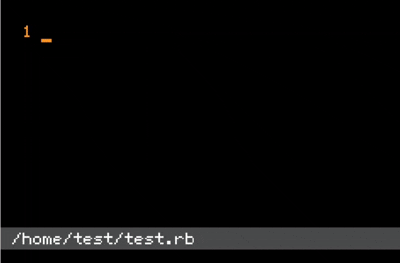

# picoruby-ti

A universal PicoRuby type inferrer

| Cardputer(ESP32 RAM512KB) | Vim + LSP |
| :---: | :---: |
|  |  |

## Overview
picoruby-ti is a universal type inference engine for PicoRuby. It is designed
to run on PCs and microcontrollers and to be called from any programming
language.

picoruby-ti has the following features:

- Uses only a few dozen kilobytes of memory, allowing it to run smoothly on
  embedded devices
- Written in C and accessible through the C interoperability features of any
  language
- Uses a computationally efficient inference algorithm

## Usage

### Prerequisites

#### Generate the type database

Before building either the LSP server or a PicoRuby integration, generate the
type database. Place the RBS files that define the classes and methods for your
target environment in `sig/`.

The type inference engine requires the following declarations:

- `Object`, `Class`, `Kernel`, and `Untyped`
- `Integer`, `Float`, `String`, and `Symbol`
- `Array`, `Hash`, `Range`, `Proc`, `TrueClass`, `FalseClass`, and `NilClass`

To get started quickly, copy the templates from `example/rbs/`. Note that these
templates are not guaranteed to contain exact type definitions for PicoRuby.

```sh
mkdir -p sig
cp example/rbs/*.rbs sig/
make gendb
```

`make gendb` reads `sig/*.rbs` in alphabetical order by file name and generates
the following files in `src/generated/`:

```text
src/generated/picoruby_ti_builtin_database.c
src/generated/picoruby_ti_builtin_database.h
```

If any required declarations are missing, the command reports a
`required RBS declarations are missing` error.

### Use as an LSP server

This example combines Go with picoruby-ti to provide an LSP server for
PicoRuby.

#### Build

Set up Go and C build environments, complete the prerequisites, and run the
following command from the repository root:

```sh
make -C lsp build
```

This generates `lsp/picoruby-ti-lsp`. The executable communicates over standard
input and output using LSP and provides diagnostics, completion, and hover
information for Ruby source files.

#### Configure your editor

The following is an example Language Server configuration for Vim. Replace
`command` with the path to the executable you built.

```json
{
  "picoruby-ti": {
    "command": "/path/to/picoruby-ti/lsp/picoruby-ti-lsp",
    "filetypes": ["ruby"],
    "rootPatterns": [".ti-loader.manifest"]
  }
}
```

No command-line arguments are required for the server.

#### `.ti-loader.manifest`

To preload other Ruby files for type inference, place a `.ti-loader.manifest`
in the same directory as the Ruby file being edited. List one file per line in
load order, using paths relative to the manifest.

```text
lib/constants.rb
lib/device.rb
```

The listed source files are concatenated from top to bottom, followed by the
source file being edited, and then analyzed. Blank lines, nonexistent files,
and the file currently being edited are skipped.

### Use as an MCP server

Start `picoruby-ti-lsp` with `--mcp` to run it as an MCP server that communicates
over standard input and output. The following is an example MCP client
configuration. Replace `command` with the actual path to the executable.

As with the LSP server, each tool preloads the source files listed in
`.ti-loader.manifest` before analyzing a Ruby file.

```json
{
  "mcpServers": {
    "picoruby-ti": {
      "command": "/path/to/picoruby-ti/lsp/picoruby-ti-lsp",
      "args": ["--mcp"]
    }
  }
}
```

#### MCP tools

| Tool | Purpose | Arguments |
| --- | --- | --- |
| `diagnostic` | Get type errors | `target_file_path` |
| `completion` | Get completion candidates | `target_file_path`, `line`, `character` |
| `hover` | Get type or method information | `target_file_path`, `line`, `character` |
| `classes` | Get available classes | `target_file_path` |
| `methods` | Get methods for a specified class | `target_file_path`, `class_name` |

### Integrate with PicoRuby

#### Add as an mrbgem

Add this repository as an mrbgem in PicoRuby's `build_config.rb`:

```ruby
conf.gem gemdir: File.expand_path('/path/to/picoruby-ti')
```

In another mrbgem that uses the type inference engine, declare the dependency
in `mrbgem.rake`:

```ruby
spec.add_dependency 'picoruby-ti'
```

Rather than exposing Ruby classes, `picoruby-ti` provides an API for use from
the integrating C code.

#### C API

Store the Ruby source files to analyze in a `TiSourceList` and pass it to the
appropriate API.

```c
#include "picoruby_ti_diagnostic.h"
#include "picoruby_ti_hover.h"
#include "picoruby_ti_suggest.h"

TiSource source_item = {
  .source = source,
  .source_byte_length = source_byte_length,
};
TiSourceList sources = {
  .items = &source_item,
  .count = 1,
};

TiDiagnosticList diagnostics;
ti_fill_diagnostics(&sources, &diagnostics);

TiSuggestionList suggestions;
ti_fill_suggestions_at_cursor(
  &sources,
  cursor_byte_offset,
  &suggestions
);

TiHoverInfo hover_info;
ti_find_hover_at_cursor(&sources, cursor_byte_offset, &hover_info);
```

The APIs serve the following purposes:

- `ti_fill_diagnostics` stores type errors in a `TiDiagnosticList`.
- `ti_fill_suggestions_at_cursor` stores completion candidates at the specified
  byte offset in a `TiSuggestionList`.
- `ti_find_hover_at_cursor` stores type or method information at the specified
  byte offset in a `TiHoverInfo`.

#### Infer types across multiple source files

When the source being analyzed depends on other Ruby source files, add the
preloaded sources to `TiSourceList` first and the target source last. For
completion and hover requests, `cursor_byte_offset` is a byte offset relative
to the beginning of the final source.
